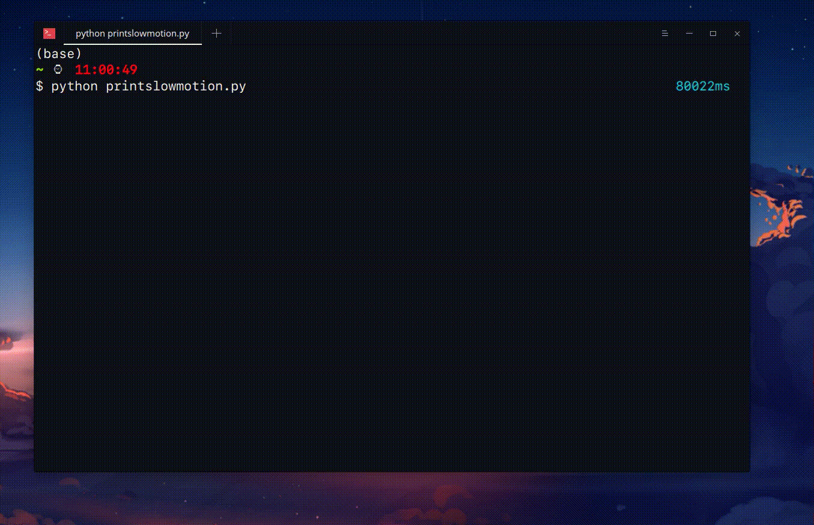

# Slow print

To do the priting slowly I just use python. Below the result:

How did I do this in python? See the source [printslowmotion.py](printslowmotion.py).

Feel free to copy and change according to your needs.